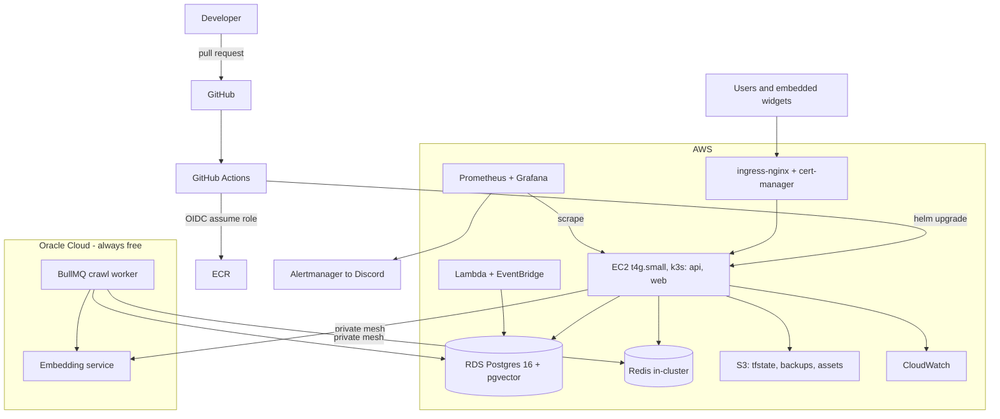

# Ragify Platform Rebuild - 8 Week Roadmap

Rebuilding Ragify's entire operational layer from an empty directory: AWS replaces DigitalOcean, the always-free Oracle Cloud VMs stay, and every piece of CI/CD, IaC, orchestration and observability gets written by hand rather than inherited.

**Duration:** 8 weeks at ~4 hrs/day
**Status:** app code works, product currently down, no users
**Goal:** relaunch on production-grade infrastructure that backs up every skill on a DevOps job ad

---

## How to use these files

One file per week: `week-01.md` through `week-08.md`. Each day is a numbered task list with the exact commands, a verification step, and acceptance criteria at the end of the day. Open today's section, work top to bottom, tick it off.

Weeks are written one at a time, just ahead of execution, so they reflect what actually happened rather than what was guessed eight weeks earlier.

## Working rules

1. **You write the infrastructure code.** Terraform, pipeline YAML, Helm charts and Ansible playbooks get typed by you using official docs. Ask AI to review afterwards, never to produce it. Every interview for these roles is "why did you do it this way" - that answer only exists if you made the decision.
2. **Nothing exists unless it is code.** No console clicking. If a resource was created by hand, delete it and write it in Terraform.
3. **Every change is a PR.** Even solo. The PR history is portfolio evidence of process.
4. **Break things freely until week 5.** The app is down and has no users, so the risky learning is deliberately scheduled before relaunch.
5. **Document decisions as you go.** `docs/adr/` for decisions, `docs/runbooks/` for procedures, `docs/incidents/` for postmortems. Written at the time, not reconstructed at the end.

## Prerequisites

Before Day 1:

- Node 20, Docker and Docker Compose installed locally
- `gh` CLI authenticated (`gh auth status`)
- DigitalOcean access (console login or `doctl`) to destroy the droplet - there is no data to rescue
- Oracle Cloud console access for the two free VMs
- A card that works online for AWS signup in week 3 - the plan stays inside the $200 credit window, so expected cost is near zero
- A Discord webhook URL for alerts later (create a private server, one channel)

## The eight weeks

**Week 1 - Clear the ground.** Destroy the DigitalOcean droplet, archive the full pre-rebuild project on branch `old`, orphan-reset `main` to application code only, establish the PR workflow, write baseline CI from an empty file, and fix the fail-open rate limiting plus the insecure default HMAC secret.

**Week 2 - Tests and containers.** Vitest integration tests against ephemeral Postgres and Redis covering auth, tenancy, quota, the SSRF guard and webhook idempotency. Multi-stage non-root Dockerfiles with healthchecks. Trivy scanning in CI.

**Week 3 - Migrations and Terraform foundation.** A real migration runner replacing init-only SQL. AWS account with budget alarm, IAM and the GitHub OIDC provider. Terraform written from scratch: S3 remote state with DynamoDB locking, modules, `envs/dev` and `envs/prod`, `plan` on every PR.

**Week 4 - AWS infrastructure.** VPC across two AZs, RDS Postgres 16 with pgvector, S3 with lifecycle rules, least-privilege IAM, ECR, CloudWatch. EC2 node via cloud-init, hardened by Ansible. The OCI VMs brought under the same Terraform root.

**Week 5 - Kubernetes and relaunch.** k3s with ingress-nginx and cert-manager, a Helm chart for api and web, a private mesh to the OCI workers, DNS pointed at AWS, and the product back online with its first real users.

**Week 6 - CI/CD end to end.** OIDC to ECR, build once and deploy by digest, smoke tests, approval gate, automatic rollback. A Jenkinsfile mirroring the pipeline. Cron endpoints replaced by Lambda on EventBridge schedules.

**Week 7 - Observability and SRE.** kube-prometheus-stack, app metrics, golden-signal and RAG-specific dashboards, SLOs with error-budget alerts, KEDA autoscaling the crawl worker on queue depth, CloudWatch log shipping, and backups with a measured restore drill.

**Week 8 - Chaos and proof.** A chaos day producing five real postmortems and runbooks, architecture diagrams, ADR set, cost report, and a 3-minute demo video of a commit reaching production.

## Target architecture

## Cost guardrails

- Steady state ~$30/month on AWS: EC2 t4g.small ~$12, RDS db.t4g.micro ~$13, S3 and ECR and CloudWatch ~$5. The $200 signup credit covers roughly six months.
- Deliberately omitted: **NAT Gateway** (~~$32/mo), **ALB** (~$16/mo), **EKS** (~~$73/mo control plane). k3s ingress handles TLS on the node; workloads sit in public subnets behind tight security groups. This tradeoff is recorded in `docs/adr/`.
- The `$5` budget alarm is the first AWS resource created, before anything else.
- Every AWS account starting after July 2025 uses the credit model, and the Free plan closes the account when six months elapse or credits run out. Screenshots, diagrams and the demo video are therefore the permanent artifacts - capture them as you go.
