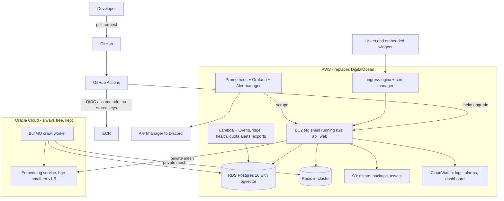

# Ragify Platform Rebuild - 8 Week Plan

## What this is

`ragify` is a working RAG SaaS: paste a URL, get a chatbot trained on that content, embed it anywhere with one line. Roughly 7,400 lines across a Vite SPA, a Hono API, a self-hosted embedding service and a BullMQ worker, with Clerk auth, Stripe billing, pgvector retrieval and Groq streaming. It is currently **down** and has no users.

The application code stays. Everything operational gets built again from an empty directory, deliberately, with professional practice - and the product comes back up on AWS instead of DigitalOcean, so every service on your target job ads is backed by something real you actually operate.

Target: 8 weeks at ~4 hrs/day.

## How we work

You execute; I guide. Each week has a markdown file in `docs/roadmap/` with day-level tasks, exact commands, verification steps and acceptance criteria. You run them, hit problems, and we debug together.

Because the app is down and has no users, **every week is safe to get wrong**. Break things freely. That freedom disappears once you relaunch in week 5, which is exactly why the risky learning happens before then.

Discipline that matters: on infrastructure work you write the Terraform, the pipeline YAML and the Helm charts yourself, using docs. Ask AI to review afterwards, not to produce it. Interviews for these roles are almost entirely "why did you do it this way", and that answer only exists if you made the decision.

## Target architecture

Why this split: the two OCI VMs are always-free forever and they host the two genuinely compute-heavy, horizontally-scalable workloads (embedding and crawling). AWS takes the stateful and managed pieces. One Terraform root spanning two clouds is also a stronger story than single-cloud.

## Cost strategy

- **Destroy the DigitalOcean droplet in week 1.** It serves nobody and is costing you money right now. There is no data worth keeping, so destroy immediately - `terraform destroy` the DO module (or delete from the console if state is empty) and cancel the account.
- New AWS accounts get **$100 credits at signup plus up to $100 from activities, valid 6 months**; the Free plan closes the account when that window ends. Choose the Free plan.
- Steady-state estimate ~$30/month: EC2 t4g.small ~$12, RDS db.t4g.micro ~$13, S3 + ECR + CloudWatch ~$5. Credits cover roughly six months.
- **No NAT Gateway** (~$32/mo) and **no ALB** (~$16/mo). k3s ingress on the node handles TLS; workloads sit in public subnets behind tight security groups. Record this as an ADR with the security tradeoff stated honestly - a costed decision reads better in an interview than a textbook diagram.
- **No EKS** (~$73/mo control plane). k3s gives the same Kubernetes skills.
- The `$5` budget alarm is the first AWS resource created, before anything else.
- When credits run out, production can move to the OCI free VMs. Keep that path documented - it is a real DR exercise.

## Phase 1, Week 1 - Clear the ground, CI from an empty file

No cloud infrastructure. Get to a repo where CI can be trusted and the old operational layer is gone.

- Destroy the DigitalOcean droplet (no data to rescue). Archive the full pre-rebuild project on branch `old`, then **orphan-reset `main` to a single commit of application code only** - dropping `infra/`, `deploy/` and `.github/workflows/`. Everything operational gets rewritten by you, not inherited.
- Point the git remote at `ragify` (still `helply` today). Terraform lock-file policy is decided when you write Terraform in week 3.
- Branch protection on `main`, PR template, CODEOWNERS, conventional commits, Dependabot.
- Write `.github/workflows/ci.yml` from scratch: lint, typecheck, format check, and **gitleaks** secret scanning.
- Fix the security defects the audit found, which are also good blog material:
  - Rate limiting and quota checks **fail open** when Redis is unavailable (`apps/api/src/modules/chat/routes.ts`, around lines 177-201). Make them fail closed.
  - `RATE_LIMIT_SECRET` falls back to `"dev-insecure-secret"` in `packages/core/src/security.ts`. Require it at boot.
  - No global error handler on the Hono app, so `.parse()` throws surface as 500s. Add one, plus zod-validated env at startup.

## Phase 2, Week 2 - Tests and container hardening

The project has **zero automated tests** today, so CI without them is theatre.

- Vitest integration tests against ephemeral Postgres and Redis covering what matters: Clerk auth, per-owner tenancy on bots and sources, quota consumption, the SSRF guard in `packages/core/src/crawler.ts`, and Stripe webhook idempotency.
- Wire tests into CI with Postgres and Redis service containers.
- Rewrite `apps/api/Dockerfile`, `apps/worker/Dockerfile` and `apps/embed/Dockerfile`: multi-stage, `USER node`, `HEALTHCHECK`, proper `.dockerignore`. All three are single-stage and run as root today.
- New `docker-compose.yml` written from scratch with healthchecks on every service, plus Trivy image scanning in CI.

## Phase 3, Week 3 - Migrations, AWS account, Terraform foundation

- Replace the init-only migration mechanism - `db/migrations/*.sql` only runs on first Postgres container start, so live schema changes are manual - with `node-pg-migrate` or `dbmate`, baselining the existing schema and running as a pre-deploy job.
- Create the AWS account: Free plan, root MFA, IAM admin user, `$5` budget alarm, and the **GitHub OIDC identity provider** so no AWS keys are ever stored.
- Write Terraform from an empty directory: S3 remote state with DynamoDB locking, reusable modules, `envs/dev` and `envs/prod`, `tflint` and `tfsec` in CI, and `terraform plan` posted as a PR comment.

## Phase 4, Week 4 - AWS infrastructure

- VPC across two AZs, security groups, S3 buckets for state, backups and assets with lifecycle rules.
- RDS Postgres 16 with the `vector` extension. Verified: RDS supports pgvector 0.8 with HNSW indexing, so `match_chunks()` and the existing HNSW index port over unchanged.
- IAM roles with least privilege, ECR repositories, CloudWatch log groups with 7-day retention.
- EC2 node via cloud-init, then an **Ansible playbook** for hardening: scoped `deploy` and `ops` users, SSH key-only with root login disabled, ufw, fail2ban, unattended-upgrades. SSH must not be open to `0.0.0.0/0`.
- Bring the two OCI VMs under the same Terraform root - they are effectively unmanaged today.

## Phase 5, Week 5 - Kubernetes and relaunch

- k3s on the EC2 node with ingress-nginx and cert-manager, replacing Caddy.
- Helm chart for api and web with per-environment values; secrets from SSM Parameter Store.
- Private mesh (Tailscale or WireGuard) between AWS and the OCI VMs, replacing firewall rules pinned to manually-supplied public IPs.
- Run the week-3 migration runner against an empty RDS to build the schema from scratch, point DNS at AWS, and **bring the product back up**. Then invite the first real users - the AI-builder communities from your client-acquisition plan are the natural audience for a "chatbot trained on your docs" tool.
- From this point production is real. Changes go through the pipeline.

## Phase 6, Week 6 - CI/CD end to end

- Full pipeline: OIDC role assumption, build once, push to ECR, Trivy scan, deploy **by digest**, smoke test, manual approval gate for prod, automatic rollback on failed health check.
- This also fixes a real bug in the old setup: `deploy.yml` pushed images to GHCR, then the SSH step ran `docker compose up -d --build` and rebuilt locally, ignoring the pushed images entirely.
- `Jenkinsfile` reproducing the same pipeline on Jenkins in Docker, so "Jenkins" on your CV is honest.
- Replace the cron HTTP endpoints (`/api/cron/health-check`, `quota-alerts`, `export-conversations`) with **Lambda functions on EventBridge schedules**, and drop the `crawl-worker` stub. Genuine Lambda usage, better architecture, and it closes the `CRON_SECRET`-open-in-non-production hole.

## Phase 7, Week 7 - Observability and SRE

- kube-prometheus-stack in the cluster; `prom-client` metrics in the API and worker; postgres, redis and node exporters.
- Dashboards on the four golden signals plus RAG-specific panels: crawl queue depth, embedding latency, chat p95, retrieval hit rate, token spend.
- Two or three explicit SLOs with **error-budget burn alerts** rather than raw CPU alarms. Alertmanager to Discord.
- **KEDA autoscaling the crawl worker on BullMQ queue depth** - the strongest single technical story here, and a real need since single-URL crawls run inline in the API and block it.
- CloudWatch log shipping via fluent-bit, metric filters, alarms.
- RDS automated backups plus `pg_dump` to S3, and a **documented restore drill with measured RPO and RTO** against seeded data (there was no production dump to restore). Backup scripts existed before but no restore was ever proven.

## Phase 8, Week 8 - Chaos, documentation, demo

- Chaos day against staging: kill the worker, take Redis down (verify the week-1 fail-closed fix), ship a bad migration, fill the disk, revoke an IAM permission. Respond as if on call.
- Five real postmortems in `docs/incidents/` plus matching runbooks in `docs/runbooks/`.
- Architecture diagrams, rewritten README, the ADR set, a cost report with screenshots, and a 3-minute video showing a commit flowing to production with Grafana reacting live.

## Continuous throughout

- Every change goes through a PR. Trade reviews with one classmate so approvals are real.
- One blog post per phase on `aahmad.app` - eight posts, both SEO and evidence you can communicate.
- Nothing exists unless it is in Terraform, Ansible or Helm. No console clicking.

## If Ragify becomes the FYP

It is academically defensible as-is (RAG, vector retrieval, self-hosted embeddings, multi-cloud deployment). If a supervisor wants a research angle, add a **retrieval evaluation harness**: a labelled question set, automated scoring of answer relevance, and a comparison of chunking strategies or hybrid keyword-plus-vector search against pure vector search. Genuine novelty that also makes the product better.

## After week 8

AWS Solutions Architect Associate. The project proves capability; the certificate clears HR filters at Systems, NetSol, Contour, Confiz, Xgrid and Cloudelligent. Realistic targets are DevOps or Cloud internships and backend roles with infrastructure responsibility, since most Lahore DevOps postings ask for 2+ years.